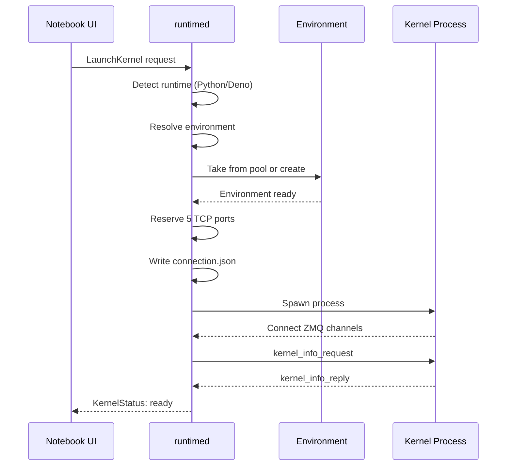

Kernels are the execution engines that run code in notebooks. nteract Desktop manages kernel processes, handles the Jupyter protocol, and routes messages between the UI and the running kernel.

## Kernel Types

nteract Desktop supports multiple kernel types through Jupyter's standard protocol:

### Python Kernels

Python kernels use `ipykernel` and support the full Jupyter messaging protocol.

**Launch command**:
```bash
python -m ipykernel_launcher -f connection.json
```

**Features**:
- Code execution
- Rich output (HTML, images, plots)
- Interactive widgets (ipywidgets)
- Magic commands (`%matplotlib`, `%timeit`, etc.)
- Completion and inspection

### Deno Kernels

Deno kernels enable TypeScript/JavaScript execution with built-in TypeScript support.

**Launch command**:
```bash
deno jupyter --kernel --conn connection.json
```

**Features**:
- TypeScript and JavaScript
- URL imports
- Top-level await
- Built-in testing and benchmarking
- Secure by default (explicit permissions)

## Kernel Lifecycle

### Startup Sequence



### Connection File

The kernel and client communicate via ZeroMQ sockets. Connection details are stored in a JSON file:

```json
{
  "ip": "127.0.0.1",
  "transport": "tcp",
  "shell_port": 54321,
  "iopub_port": 54322,
  "stdin_port": 54323,
  "control_port": 54324,
  "hb_port": 54325,
  "key": "signature-key",
  "signature_scheme": "hmac-sha256"
}
```

**Channels**:
- **shell**: Request/reply for code execution, completion, inspection
- **iopub**: Broadcasts for output, status, execution counts
- **stdin**: Prompts for user input (e.g., `input()` in Python)
- **control**: Interrupt and shutdown commands
- **hb**: Heartbeat for liveness checks

### Execution Modes

nteract Desktop supports two kernel execution modes:

#### Standard Mode (Default)

The notebook app owns the kernel process directly.

```
Notebook Window
  ├── Spawns kernel process
  ├── Connects ZMQ sockets
  ├── Subscribes to iopub
  └── Sends execution requests
```

**Characteristics**:
- Kernel lifecycle tied to window
- Closing window terminates kernel
- Each window has independent kernel state
- Full widget support

#### Daemon Mode (Experimental)

The daemon owns kernel processes. Windows are thin views.

```
Notebook Window
  └── Sends LaunchKernel/QueueCell to daemon
  └── Receives broadcasts from daemon

runtimed Daemon
  ├── Owns kernel process
  ├── Subscribes to iopub
  ├── Writes outputs to Automerge
  └── Broadcasts to all connected windows
```

**Characteristics**:
- Kernels survive window closes
- Multi-window kernel sharing
- Outputs persist in daemon
- Project file auto-detection

<Warning>
**Widget limitation**: In daemon mode, widgets only render in the window that was active when created. Secondary windows show "Loading widget" due to missing `comm_open` history.
</Warning>

Enable in settings: `daemon_execution: true`

## Jupyter Protocol

### Message Types

#### Shell Channel (Request/Reply)

| Message Type | Purpose |
|--------------|----------|
| `execute_request` | Run code |
| `complete_request` | Tab completion |
| `inspect_request` | Object introspection |
| `kernel_info_request` | Kernel metadata |
| `is_complete_request` | Check if code is complete |
| `interrupt_request` | Interrupt execution |
| `shutdown_request` | Shutdown kernel |

#### IOPub Channel (Broadcast)

| Message Type | Purpose |
|--------------|----------|
| `stream` | stdout/stderr output |
| `display_data` | Rich display outputs |
| `execute_result` | Return value of executed code |
| `error` | Exception tracebacks |
| `execute_input` | Echo of executed code |
| `status` | Kernel state (idle/busy/starting) |
| `clear_output` | Clear cell outputs |

#### Comm Protocol (Widgets)

| Message Type | Purpose |
|--------------|----------|
| `comm_open` | Establish widget communication |
| `comm_msg` | Widget state updates |
| `comm_close` | Close widget channel |

### Message Structure

All Jupyter messages follow this structure:

```json
{
  "header": {
    "msg_id": "uuid",
    "msg_type": "execute_request",
    "username": "user",
    "session": "session-id",
    "date": "2026-03-03T12:00:00Z",
    "version": "5.3"
  },
  "parent_header": {},
  "metadata": {},
  "content": {
    "code": "print('hello')",
    "silent": false,
    "store_history": true,
    "user_expressions": {},
    "allow_stdin": true,
    "stop_on_error": true
  },
  "buffers": []
}
```

## Kernel State Management

### Execution Queue

Cells are queued for execution in order:

1. **Idle** → Cell waiting to execute
2. **Queued** → Cell in execution queue
3. **Executing** → Kernel actively running cell
4. **Complete** → Execution finished (success or error)

The queue ensures cells execute sequentially, maintaining state consistency.

### Interrupt

Interrupt the currently executing cell:

```
UI sends interrupt_request → Kernel receives signal → Execution stops → Returns error
```

Python kernels receive `KeyboardInterrupt`. Deno kernels terminate the current execution.

### Restart

Restart the kernel to clear state:

1. Shutdown current kernel process
2. Spawn new kernel with same connection file
3. Reconnect ZMQ channels
4. Reinitialize kernel state

<Note>
Restarting clears all variables, imports, and execution history. Outputs in cells are preserved.
</Note>

## Environment Source Labels

The daemon returns an `env_source` string with the `kernel:lifecycle` event indicating where the environment came from:

**UV environments**:
- `uv:inline` — Inline dependencies from notebook metadata
- `uv:pyproject` — Project's `pyproject.toml`
- `uv:prewarmed` — Prewarmed pool environment

**Conda environments**:
- `conda:inline` — Inline dependencies from notebook metadata
- `conda:env_yml` — Project's `environment.yml`
- `conda:pixi` — Project's `pixi.toml`
- `conda:prewarmed` — Prewarmed pool environment

This label appears in the kernel status indicator in the UI.

## Widget Support

Interactive widgets (ipywidgets) enable rich UI controls in notebooks.

### Widget Architecture

```
Python Code
  └── ipywidgets.Widget()
      └── comm_open message
          └── Model state transmitted
              └── Frontend widget renders
                  └── User interaction
                      └── comm_msg updates model
```

### Comm Message Routing

**Standard mode**:
```
Kernel ←→ ZMQ iopub ←→ Notebook Window ←→ Widget Frontend
```

**Daemon mode**:
```
Kernel ←→ ZMQ iopub ←→ Daemon ←→ Broadcast ←→ Notebook Window ←→ Widget Frontend
```

The daemon forwards `comm_open`, `comm_msg`, and `comm_close` messages bidirectionally.

### Widget State Persistence

Widget state is stored in notebook metadata:

```json
{
  "metadata": {
    "widgets": {
      "application/vnd.jupyter.widget-state+json": {
        "state": {},
        "version_major": 2,
        "version_minor": 0
      }
    }
  }
}
```

This allows widgets to restore their state when the notebook is reopened.

## Monitoring Kernels

### List Running Kernels

```bash
runt ps
```

Shows all kernels with connection file paths and PIDs.

### List Notebook Kernels

```bash
runt notebooks
```

Shows open notebooks with:
- Notebook path or ID
- Kernel type (python/deno)
- Environment source
- Kernel status (idle/busy)
- Number of connected peers

### Daemon Logs

```bash
runt daemon logs -f
```

Kernel-related logs include:
- Launch commands
- Environment detection
- ZMQ connection status
- Execution queue state
- Output handling

## Performance Considerations

### Prewarmed Environments

Prewarmed pools make kernel startup nearly instant:

- **Cold start** (no pool): 5-10 seconds
- **Warm start** (from pool): &lt;1 second

The daemon maintains 3 UV + 3 Conda environments ready.

### Output Handling

Large outputs are stored in the blob store to avoid CRDT bloat:

- **Small outputs** (&lt;8KB): Inlined in Automerge doc
- **Large outputs** (≥8KB): Stored as blobs, hash in doc

This keeps sync protocol fast even with large images or logs.

### Execution Latency

Message round-trip times:

- **Local ZMQ**: &lt;1ms
- **Execute request → first output**: ~5-20ms
- **Multi-window sync**: &lt;50ms

The dual-channel design (Automerge + broadcasts) ensures executing windows see outputs instantly.

## Troubleshooting

<Accordion title="Kernel won't start">
Check daemon logs for errors:

```bash
runt daemon logs -f
```

Common issues:
- Environment not found or corrupted
- Port conflicts (rare, ports are randomized)
- Python/Deno not in PATH
- Permission issues with connection file
</Accordion>

<Accordion title="Kernel stuck in 'busy' state">
The kernel is executing code or waiting for input.

**Solutions**:
- Click the interrupt button to stop execution
- Check for `input()` calls requiring stdin
- Restart the kernel if truly stuck
</Accordion>

<Accordion title="Widgets not rendering">
**Standard mode**:
- Ensure `ipywidgets` is installed in the environment
- Check browser console for JavaScript errors

**Daemon mode**:
- Widgets only work in the window that created them (known limitation)
- Switch to standard mode for full widget support
</Accordion>

<Accordion title="Outputs disappear after restart">
Restarting the kernel clears execution state but preserves outputs in cells.

If outputs are missing:
- They may have been cleared before restart
- Check if the notebook was saved with outputs
- In daemon mode, outputs persist in the Automerge doc even across restarts
</Accordion>

## Next Steps

<CardGroup cols={2}>
  <Card title="Environments" href="/concepts/environments" icon="box">
    Learn about environment management
  </Card>
  <Card title="Daemon" href="/concepts/daemon" icon="server">
    Understand the daemon's role
  </Card>
  <Card title="Notebooks" href="/concepts/notebooks" icon="book">
    Explore notebook format
  </Card>
  <Card title="Synchronization" href="/concepts/sync" icon="arrows-rotate">
    Deep dive into CRDT sync
  </Card>
</CardGroup>
