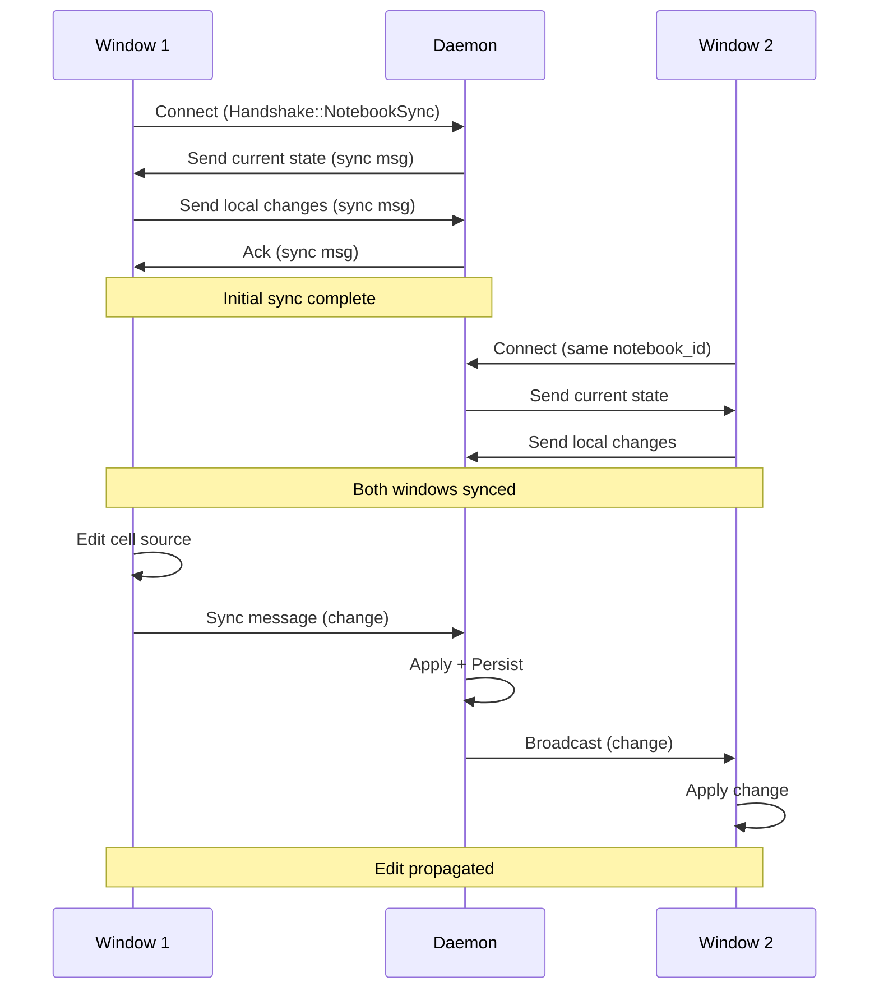

nteract Desktop uses Conflict-free Replicated Data Types (CRDTs) via Automerge to enable real-time synchronization of notebook state across multiple windows and the daemon.

## Why CRDTs?

Traditional approaches to multi-user editing require:

- **Central server** making decisions about conflicts
- **Locking** preventing concurrent edits
- **Last-write-wins** losing data on conflicts

CRDTs enable:

- **Automatic merge** of concurrent edits
- **No central authority** needed for conflict resolution
- **Eventual consistency** all replicas converge to the same state
- **Offline-first** edits work without connectivity

<Info>
Automerge is a CRDT library that provides JSON-like documents with automatic merge semantics.
</Info>

## Sync Architecture

### Two Sync Channels

nteract Desktop maintains two separate Automerge documents:

#### 1. Settings Document

A single shared document for user preferences:

```
ROOT/
  theme: "system"
  default_runtime: "python"
  default_python_env: "uv"
  uv/
    default_packages: ["numpy", "pandas"]
  conda/
    default_packages: ["scipy"]
```

**Synced across**: All notebook windows

**Persistence**: `~/.cache/runt/settings.automerge` with JSON mirror at `~/.config/nteract/settings.json`

**Migration**: Backward-compatible migration from flat keys to nested structures

#### 2. Notebook Documents

Each open notebook gets its own Automerge document in a "room":

```
ROOT/
  notebook_id: Str
  cells/
    [i]/
      id: Str
      cell_type: Str
      source: Text              # Automerge Text CRDT
      execution_count: Str
      outputs/
        [j]: Str                # Output manifest hash
  metadata/
    runtime: Str
```

**Synced across**: All windows viewing the same notebook

**Persistence**: `~/.cache/runt/notebook-docs/{sha256(notebook_id)}.automerge`

### Room-Based Architecture

The daemon manages notebook sync through rooms:

```rust
pub struct NotebookRoom {
    pub doc: Arc<RwLock<NotebookDoc>>,
    pub changed_tx: broadcast::Sender<()>,
    pub persist_path: PathBuf,
    pub active_peers: AtomicUsize,
}
```

**Room lifecycle**:

1. **First window opens** → Daemon creates/loads room
2. **Client handshake** → `Handshake::NotebookSync { notebook_id }`
3. **Initial sync** → Exchange Automerge sync messages until convergence
4. **Watch loop** → Listen for local edits and peer changes
5. **Peer changes** → Apply, persist, broadcast to other peers
6. **Last window closes** → Room evicted, document persisted

<Note>
Rooms are identified by `notebook_id`. Multiple windows opening the same notebook join the same room automatically.
</Note>

## Sync Protocol

### Wire Format

Length-prefixed binary frames over Unix socket:

```
[4 bytes: length (big-endian u32)] [Automerge sync message]
```

Automerge sync messages are binary-encoded change sets, not JSON.

### Sync Flow



### Initial Sync

1. **Server sends first**: Daemon initiates with its current state
2. **Client responds**: Window sends its local changes (if any)
3. **Exchange until convergence**: Both sides send sync messages with 100ms timeout
4. **Sync complete**: Both replicas have identical state

### Change Propagation

After initial sync, changes propagate immediately:

1. **Local edit**: Window modifies Automerge doc
2. **Generate sync message**: Automerge creates minimal change representation
3. **Send to daemon**: Sync message over socket
4. **Daemon applies**: Under write lock, update canonical doc
5. **Persist**: Serialize and write to disk (outside lock)
6. **Broadcast**: Notify all other peers
7. **Peers apply**: Other windows receive and apply change

<Info>
Latency target: Sub-200ms from edit in Window A to display in Window B for local connections.
</Info>

## Conflict Resolution

### Concurrent Edits

Two windows editing the same cell simultaneously:

**Window A**: Types `hello` in cell source
**Window B**: Types `world` in same cell source

Automerge's Text CRDT merges these character-level:

1. Both edits applied to document
2. Automerge determines character insertion order
3. Result might be `helloworld` or `worldhello` (deterministic based on Lamport clocks)
4. Both windows converge to same final text

**Key property**: No data is lost, edits are merged automatically.

### Deterministic Merge

Automerge uses logical clocks to establish a total order on concurrent operations:

```
Operation from Actor A at time T1
Operation from Actor B at time T2

If T1 < T2: A's change ordered before B's
If T1 == T2: Tie-break by actor ID (lexicographic)
```

All replicas apply the same ordering, guaranteeing convergence.

### Write-Once Data

Outputs are write-once from a single actor (the kernel), so they don't need CRDT semantics:

```
cell/
  outputs/
    [0]: "manifest-hash-1"    # Written once by kernel
    [1]: "manifest-hash-2"    # Appended, never modified
```

No concurrent editing of outputs, so simple list append works.

## Text Editing Semantics

Cell source uses Automerge's `Text` type for proper concurrent editing:

### Character-Level Merging

**Window A**: `"hello"` → `"hello world"`
**Window B**: `"hello"` → `"hello there"`

Automerge represents this as:

```
['h', 'e', 'l', 'l', 'o']
  → Window A inserts [' ', 'w', 'o', 'r', 'l', 'd'] at position 5
  → Window B inserts [' ', 't', 'h', 'e', 'r', 'e'] at position 5
```

Merged result: Both insertions applied, order determined by Lamport clocks.

### Update Operation

When you type in a cell, the frontend sends the full new text:

```rust
sync_client.update_source(cell_id, new_source)
```

Internally, Automerge:

1. Runs Myers diff algorithm
2. Generates minimal character-level patch
3. Applies patch operations (insert/delete)
4. Broadcasts patch, not full text

This keeps sync messages small even for large cells.

## Persistence

### Automerge Binary Format

Documents are saved as compact binary (not JSON):

```
~/.cache/runt/settings.automerge        # Settings doc
~/.cache/runt/notebook-docs/{hash}.automerge  # Notebook docs
```

**Format**: Automerge's native binary serialization including full CRDT history.

**Size**: Grows with edit history. Occasional compaction removes old history.

### Persistence Strategy

After every sync message:

1. **Serialize**: Inside write lock, call `doc.save()`
2. **Write to disk**: Outside write lock, async I/O
3. **Atomic write**: Temp file + rename for crash safety

I/O happens outside the lock so it doesn't block other peers.

### Corrupt Document Recovery

If a persisted `.automerge` file can't be loaded:

1. Rename to `.automerge.corrupt`
2. Create fresh document
3. Log warning
4. Continue operation

This preserves corrupt data for debugging without blocking the user.

## Settings Sync

### JSON Mirror

Settings maintain a JSON mirror for external tool compatibility:

**Automerge doc**: `~/.cache/runt/settings.automerge` (canonical)
**JSON mirror**: `~/.config/nteract/settings.json` (read-only view)

The daemon watches the JSON file with a debounced file watcher (500ms):

1. External tool edits JSON
2. Daemon detects change
3. Parse JSON, apply to Automerge doc
4. Persist Automerge binary (not back to JSON)
5. Broadcast to all peers

<Warning>
The JSON file is overwritten on first run. Manual edits are preserved via Automerge after being imported.
</Warning>

### Migration

Backward-compatible migration from flat keys:

**Old format**:
```json
{
  "default_uv_packages": "numpy, pandas"
}
```

**New format**:
```json
{
  "uv": {
    "default_packages": ["numpy", "pandas"]
  }
}
```

Migration runs on load, converting flat keys to nested structure.

## Multi-Window Benefits

<CardGroup cols={2}>
  <Card title="Real-Time Collaboration" icon="users">
    Multiple windows editing the same notebook see changes in real-time.
  </Card>
  <Card title="Late-Joiner Sync" icon="door-open">
    Open a second window and it catches up instantly with current state.
  </Card>
  <Card title="Output Sharing" icon="image">
    Execute in one window, outputs appear in all windows viewing that notebook.
  </Card>
  <Card title="No Save Conflicts" icon="triangle-exclamation">
    Automatic merge means no "file changed on disk" dialogs.
  </Card>
</CardGroup>

## Performance

### Latency Measurements

| Operation | Typical Latency |
|-----------|------------------|
| Local edit → sync message | &lt;5ms |
| Sync message round-trip | 1-5ms (local daemon) |
| Daemon apply + persist | 5-20ms |
| Total edit propagation | &lt;50ms |

### Optimization: Dual Channel

For execution outputs, nteract uses a dual-channel design:

**Channel 1 (Automerge)**: Durable, synced state
**Channel 2 (Broadcasts)**: Ephemeral, real-time events

When a cell executes:

1. Kernel outputs → daemon writes to Automerge (persisted)
2. Daemon also sends broadcast event to all peers (fast)
3. Executing window shows output from broadcast (&lt;50ms)
4. Other windows apply Automerge change (synced state)

This gives low-latency display while maintaining consistency.

### Batching

Rapid consecutive changes can be batched:

```
Edit 1 → Edit 2 → Edit 3 → ... → Edit N
  ↓
Batched sync message (after debounce)
```

Debounce period: 50-100ms. Balances responsiveness with message overhead.

## Known Limitations

### Widget Multi-Window Sync

Widgets only render in the window that created them. Secondary windows show "Loading widget" because they miss the initial `comm_open` message.

**Root cause**: The Jupyter comm protocol establishes widget models via messages. Late joiners don't receive historical messages.

**Workaround**: Use single window for widget-heavy notebooks.

**Future fix**: Sync widget/comm state via Automerge for late-joiner reconstruction.

### Output Sync Race

During cell execution, there's a brief window where daemon sync updates may conflict with local output updates:

1. Frontend clears outputs, marks cell executing
2. Kernel outputs arrive, frontend updates local state
3. Frontend calls `sync_append_output` (async to daemon)
4. Daemon may send `notebook:updated` before append arrives

The frontend tracks "executing cells" and preserves local outputs for those cells during sync.

**Proper fix**: Store `parent_header.msg_id` in cell metadata to correlate execution requests with outputs.

## Troubleshooting

<Accordion title="Changes not syncing">
**Check**:

1. Daemon running: `runt daemon status`
2. Same notebook_id: Check daemon logs for room join
3. Socket permissions: `ls -l ~/.cache/runt/runtimed.sock`

**Debug**:

```bash
runt daemon logs -f | grep notebook-sync
```

Look for sync messages and errors.
</Accordion>

<Accordion title="Sync latency high">
**Causes**:

- Large Automerge document (many historical changes)
- Disk I/O bottleneck (spinning disk)
- Many peers (broadcast overhead)

**Solutions**:

- Compact Automerge doc (future feature)
- Use SSD for cache directory
- Limit number of concurrent windows
</Accordion>

<Accordion title="Document corrupted">
**Symptoms**: Error loading notebook, sync fails

**Check**:

```bash
ls -lh ~/.cache/runt/notebook-docs/
```

Look for `.automerge.corrupt` files.

**Recovery**:

1. Delete corrupted file
2. Reopen notebook (loads from .ipynb)
3. Fresh Automerge doc created
</Accordion>

## Advanced: Inspecting Sync State

### List Active Rooms

```bash
runt daemon status
```

Shows active notebook rooms with peer counts.

### Inspect Notebook State

```bash
runt notebooks
```

Shows all open notebooks with:
- Notebook ID
- Number of active peers
- Kernel status
- Environment source

### Daemon Logs

```bash
runt daemon logs -f
```

Sync-related logs:
- `[notebook-sync]` Room lifecycle
- `[automerge]` Sync protocol messages
- `[persist]` Document save operations

## Next Steps

<CardGroup cols={2}>
  <Card title="Daemon" href="/concepts/daemon" icon="server">
    Learn about room management
  </Card>
  <Card title="Notebooks" href="/concepts/notebooks" icon="book">
    Understand notebook format
  </Card>
  <Card title="Architecture" href="/concepts/architecture" icon="diagram-project">
    View system overview
  </Card>
  <Card title="Kernels" href="/concepts/kernels" icon="microchip">
    Explore kernel execution
  </Card>
</CardGroup>
