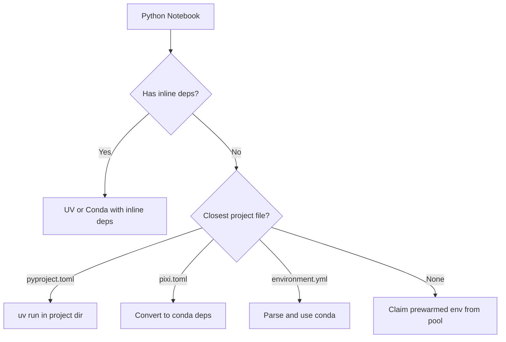
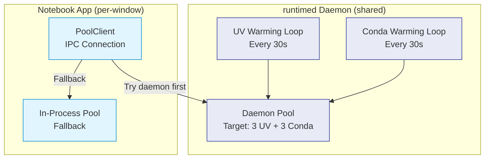
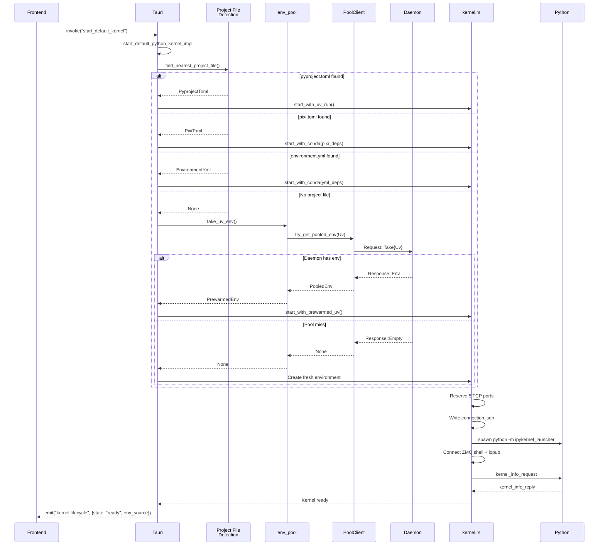
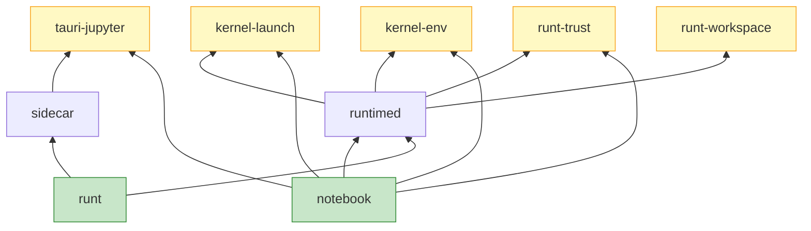
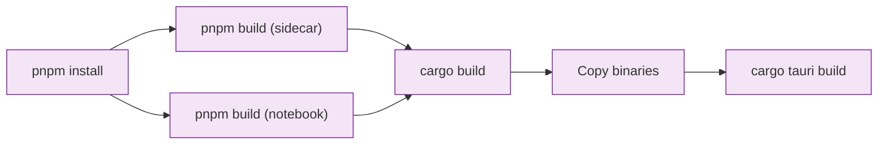

This guide covers the deep technical architecture of nteract Desktop, including the daemon, environment management, and notebook synchronization.

## System Overview

nteract Desktop is built on a daemon-based architecture with the following components:

| Component | Technology | Role |
|-----------|-----------|------|
| **Desktop App** | Tauri + React | Notebook editor UI |
| **runtimed Daemon** | Rust (Tokio) | Background process managing environments, kernels, sync |
| **runt CLI** | Rust | Command-line interface for daemon interaction |
| **Sidecar** | Rust (wry/tao) | Isolated output viewer |
| **Python Bindings** | PyO3 | Python API for the daemon |

## Core Architecture Principles

### 1. Daemon as Source of Truth

The runtimed daemon owns all runtime state. Clients (UI, agents, CLI) are views into daemon state, not independent state holders.

**Implications:**
- Clients subscribe to daemon state via IPC
- State changes flow through the daemon, not peer-to-peer
- If the daemon restarts, clients reconnect and resync

### 2. Automerge Document as Canonical Notebook State

The Automerge CRDT document is the source of truth for notebook content: cells, their sources, metadata, and structure.

**Implications:**
- Cell source code lives in the Automerge doc
- To execute a cell: write it to the doc first, then request execution by cell_id
- Multiple clients editing the same notebook see each other's changes in real-time
- The daemon reads from the doc when executing

### 3. On-Disk Notebook as Checkpoint

The `.ipynb` file on disk is a checkpoint/snapshot that the daemon periodically saves.

**Implications:**
- Daemon reads `.ipynb` on first open, loads into Automerge doc
- Daemon writes `.ipynb` on explicit save or auto-save intervals
- Unknown metadata keys preserved through round-trips
- Crash recovery: last checkpoint + Automerge doc replay

### 4. Local-First Editing, Synced Execution

Editing is local-first for responsiveness. Execution is always against synced state.

**Flow:**
```
Client                              Daemon
  |                                   |
  |-- [sync: update cell source] ---->|
  |<-- [sync: ack] -------------------|
  |                                   |
  |-- ExecuteCell { cell_id } ------->|  // No code parameter
  |<-- CellQueued -------------------|
  |<-- ExecutionStarted --------------|
  |<-- Output ------------------------|
  |<-- ExecutionDone -----------------|
```

### 5. Binary Separation via Manifests

Cell outputs are stored as content-addressed blobs with manifest references.

**Benefits:**
- Output broadcasts contain blob hashes, not inline data
- Large outputs (images, plots) don't block document sync
- Clients resolve blobs from the blob store (disk or HTTP)
- Deduplication and lazy loading

### 6. Daemon Manages Runtime Resources

The daemon owns kernel lifecycle, environment pools, and tooling.

**Benefits:**
- Clients don't spawn kernels directly
- Environment selection based on notebook metadata
- Tool availability via rattler bootstrap
- Clients are stateless with respect to runtime resources

## Environment Management Architecture

### Two-Stage Detection

Kernel launching uses a two-stage detection:

**Stage 1: Runtime Detection** (Python vs Deno)

The daemon reads the notebook's kernelspec:

```mermaid
graph TD
    A[Notebook Opened] --> B{Check kernelspec.name}
    B -->|"deno"| C[Launch Deno Kernel]
    B -->|Contains "python"| D[Resolve Python Environment]
    B -->|Unknown| E{Check language}
    E -->|"typescript"| C
    E -->|Other| F[Use default_runtime Setting]
```

**Stage 2: Python Environment Resolution**

For Python notebooks:



### Project File Discovery

Project files are discovered via a **single walk-up** from the notebook directory:

- Checks for `pyproject.toml`, `pixi.toml`, `environment.yml` at each level
- First (closest) match wins
- Same-directory tiebreaker: pyproject.toml > pixi.toml > environment.yml
- Stops at `.git` boundaries and home directory

**Key invariant:** The notebook's encoded kernelspec takes priority over project files. A Deno notebook in a directory with `pyproject.toml` will launch a Deno kernel.

### Environment Source Labels

The backend returns an `env_source` string with the `kernel:lifecycle` event:

| Source | Meaning |
|--------|---------||
| `uv:inline` | UV with inline notebook dependencies |
| `uv:pyproject` | UV with pyproject.toml |
| `uv:prewarmed` | UV from prewarmed pool |
| `conda:inline` | Conda with inline notebook dependencies |
| `conda:env_yml` | Conda with environment.yml |
| `conda:pixi` | Conda with pixi.toml |
| `conda:prewarmed` | Conda from prewarmed pool |

### Content-Addressed Caching

Environments are cached by a hash of their dependencies:

**UV:**
- Hash = SHA256(sorted deps + requires_python + env_id), first 16 hex chars
- Location: `~/.cache/runt/envs/{hash}/`
- When deps are non-empty, env_id excluded (cross-notebook sharing)
- When deps are empty, env_id included (per-notebook isolation)

**Conda:**
- Hash = SHA256(sorted deps + channels + python version + env_id), first 16 hex chars
- Location: `~/.cache/runt/conda-envs/{hash}/`

### Prewarmed Environment Pool

To make notebook startup instant, nteract maintains pools of pre-created environments.

**Two-tier architecture:**



**Fallback chain:**
1. Try daemon pool (shared across windows)
2. Try in-process pool (local to this window)
3. Create fresh environment

### Inline Dependency Environments

For notebooks with inline UV dependencies (`metadata.runt.uv.dependencies`), the daemon creates **cached environments** in `~/.cache/runt/inline-envs/`.

Environments are keyed by a hash of the sorted dependencies:

```
~/.cache/runt/inline-envs/
  inline-a1b2c3d4/    # Hash of ["requests"]
  inline-e5f6g7h8/    # Hash of ["pandas", "numpy"]
```

**Flow:**
1. `notebook_sync_server.rs` detects `uv:inline` from trusted notebook metadata
2. Calls `inline_env::prepare_uv_inline_env(deps)` which returns cached env or creates new one
3. Kernel launches with the cached env's Python

**Cache hit = instant startup.**

## Daemon Architecture

### Singleton Per User

The daemon runs as a singleton background process:

**macOS:** `launchd` service at `~/Library/LaunchAgents/io.nteract.runtimed.plist`

**Linux:** `systemd` user service

**Singleton lock:** `~/.cache/runt/daemon.lock`

### IPC Communication

Clients communicate with the daemon via:

**Unix:** Unix domain socket at `~/.cache/runt/runtimed.sock`

**Windows:** Named pipe at `\\.\pipe\runtimed`

**Protocol:** Length-prefixed JSON messages

**Multiplexing:** Single socket handles:
- Environment pool requests (Take, Return, Status)
- Automerge sync messages
- Settings sync
- Ping/health checks

### State Storage

Daemon state lives at:

```
~/.cache/runt/
├── runtimed.sock           # IPC socket
├── runtimed.log            # Daemon logs
├── daemon.json             # PID, version, endpoint
├── daemon.lock             # Singleton lock
├── envs/                   # Prewarmed environments
│   ├── runtimed-uv-{uuid}/
│   └── runtimed-conda-{uuid}/
├── inline-envs/            # Inline dependency envs
│   └── inline-{hash}/
├── conda-envs/             # Conda environments
│   └── conda-{hash}/
├── blobs/                  # Content-addressed blob store
└── notebook-docs/          # Automerge notebook docs
```

### Dev Mode (Per-Worktree Isolation)

Each git worktree can run its own isolated daemon during development:

**Enabled when:**
- `CONDUCTOR_WORKSPACE_PATH` is set (Conductor users)
- `RUNTIMED_DEV=1` is set (manual opt-in)

**State location:** `~/.cache/runt/worktrees/{hash}/`

**Benefits:**
- No conflicts when testing across branches
- Code changes take effect immediately on restart
- No interference with system daemon

**Workflow:**

```bash
# Terminal 1: Start dev daemon
cargo xtask dev-daemon

# Terminal 2: Run notebook app
cargo xtask dev

# App connects to worktree daemon, not system daemon
```

## Kernel Launching

### Kernel Startup Sequence



### Tool Bootstrapping

Tools (deno, uv, ruff) are automatically installed from conda-forge if not found on PATH:

```rust
use kernel_launch::tools;

let deno = tools::get_deno_path().await?;  // PATH first, then ~/.cache/runt/tools/
let uv = tools::get_uv_path().await?;
let ruff = tools::get_ruff_path().await?;
```

This uses [rattler](https://github.com/mamba-org/rattler) to solve and install packages from conda-forge.

## Trust System

Dependencies are signed with HMAC-SHA256 to prevent untrusted code execution on notebook open.

**Key:** 32 random bytes at `~/.config/runt/trust-key`, generated on first use

**Signed content:** Canonical JSON of `metadata.uv` + `metadata.conda` (not cell contents or outputs)

**Signature format:** `"hmac-sha256:{hex_digest}"` stored in notebook metadata

**Machine-specific:** The key is per-machine, so every shared notebook is untrusted on the recipient's machine

**Verification:** `trust.rs:verify_signature()` returns `TrustStatus`:
- `Trusted`
- `Untrusted`
- `SignatureInvalid`
- `NoDependencies`

## Crate Architecture

### Workspace Structure

```
crates/
├── notebook/          # Tauri app (main binary)
├── runtimed/          # Background daemon
├── runt/              # CLI binary
├── sidecar/           # Output viewer
├── kernel-launch/     # Shared kernel launching
├── kernel-env/        # Environment management
├── tauri-jupyter/     # Shared Jupyter types
├── runt-trust/        # Trust verification
├── runt-workspace/    # Workspace detection
├── runtimed-py/       # Python bindings
└── xtask/             # Build orchestration
```

### Dependency Graph



### Key Files

#### Daemon (Kernel Management)

| File | Role |
|------|------|
| `crates/runtimed/src/daemon.rs` | Background daemon pool management |
| `crates/runtimed/src/notebook_sync_server.rs` | `auto_launch_kernel()` — runtime and environment detection |
| `crates/runtimed/src/kernel_manager.rs` | `RoomKernel::launch()` — spawns kernel processes |
| `crates/runtimed/src/inline_env.rs` | Cached environment creation for inline UV deps |

#### Notebook Crate (Tauri Commands)

| File | Role |
|------|------|
| `crates/notebook/src/lib.rs` | Tauri commands, `start_default_python_kernel_impl` |
| `crates/notebook/src/project_file.rs` | Unified closest-wins project file detection |
| `crates/notebook/src/kernel.rs` | Kernel process management |
| `crates/notebook/src/uv_env.rs` | UV environment creation and caching |
| `crates/notebook/src/conda_env.rs` | Conda environment creation via rattler |
| `crates/notebook/src/env_pool.rs` | Prewarmed environment pool |
| `crates/notebook/src/pyproject.rs` | pyproject.toml discovery and parsing |
| `crates/notebook/src/pixi.rs` | pixi.toml discovery and parsing |
| `crates/notebook/src/environment_yml.rs` | environment.yml discovery and parsing |
| `crates/notebook/src/trust.rs` | HMAC trust verification |

#### Shared Kernel Launch Crate

| File | Role |
|------|------|
| `crates/kernel-launch/src/lib.rs` | Public API for kernel launching |
| `crates/kernel-launch/src/tools.rs` | Tool bootstrapping (deno, uv, ruff) via rattler |

#### Frontend

| File | Role |
|------|------|
| `apps/notebook/src/hooks/useKernel.ts` | Frontend kernel lifecycle and auto-launch |
| `apps/notebook/src/hooks/useDependencies.ts` | Frontend UV dep management |
| `apps/notebook/src/hooks/useCondaDependencies.ts` | Frontend conda dep management |

## Frontend Architecture

### Component Structure

```
src/
├── components/
│   ├── ui/                    # shadcn primitives
│   ├── cell/                  # Notebook cells
│   ├── outputs/               # Output renderers
│   ├── editor/                # CodeMirror editor
│   └── widgets/               # ipywidgets controls
└── lib/
    └── utils.ts               # cn() and utilities
```

### Key Hooks

| Hook | Purpose |
|------|---------||
| `useKernel.ts` | Kernel lifecycle, auto-launch detection |
| `useDependencies.ts` | UV dependency management |
| `useCondaDependencies.ts` | Conda dependency management |
| `useNotebook.ts` | Notebook state and cells |
| `useSettings.ts` | User preferences sync |

### Dependency Management UI

Two parallel UI components:

| Component | Hook | Manages |
|-----------|------|---------||
| `DependencyHeader.tsx` | `useDependencies.ts` | UV deps, pyproject.toml detection |
| `CondaDependencyHeader.tsx` | `useCondaDependencies.ts` | Conda deps, environment.yml and pixi.toml detection |

## Build System

### Build Order



**Why this order?**
- `sidecar` crate embeds `apps/sidecar/dist/` via rust-embed
- `notebook` crate embeds `apps/notebook/dist/` via Tauri
- Tauri bundles `runtimed` and `runt` binaries as sidecar processes

### xtask Orchestration

The `xtask` crate orchestrates the full build:

```rust
// Simplified xtask logic
fn build() {
    run("pnpm", &["build"])?;              // Build frontends
    run("cargo", &["build", "--release"])?; // Build Rust
    copy_binaries()?;                       // Copy to Tauri bundle dir
}
```

Commands:
- `cargo xtask build` — Full debug build
- `cargo xtask build --rust-only` — Skip frontend rebuild
- `cargo xtask build-app` — Release .app/.AppImage/.exe
- `cargo xtask build-dmg` — Release DMG (macOS)

## Performance Considerations

### Instant Notebook Startup

Prewarmed environments make kernel startup instant:
- Pool maintains 3 ready UV envs + 3 ready Conda envs
- Warming loops run every 30s
- Environments include ipykernel, ipywidgets, and common deps
- Python bytecode precompiled (`.pyc` warmup)

### Content-Addressed Caching

Identical dependencies share a single environment:
- Notebook A with `["pandas", "numpy"]`
- Notebook B with `["numpy", "pandas"]`
- Both use the same cached environment (sorted before hashing)

### Blob Store for Outputs

Large outputs don't block sync:
- Outputs stored as content-addressed blobs
- Sync protocol sends blob hashes only
- Clients fetch blobs lazily on demand
- Deduplication across notebooks

## Security

### Iframe Isolation

Notebook outputs run in a sandboxed iframe:
- `sandbox="allow-scripts allow-same-origin"`
- Tauri API not exposed to iframe
- postMessage eval channel for controlled communication

See `contributing/iframe-isolation.md` for details.

### Trust System

Untrusted notebooks require explicit approval before installing dependencies:
- Trust dialog shown on first open
- HMAC signature verification
- Per-machine trust keys
- Prevents automatic code execution

## Next Steps

- [Building from Source](/development/building) - Set up your environment
- [Testing](/development/testing) - Run and write tests
- [Contributing Guidelines](/development/contributing) - Contribution workflow
- [Release Process](/development/release-process) - How releases work