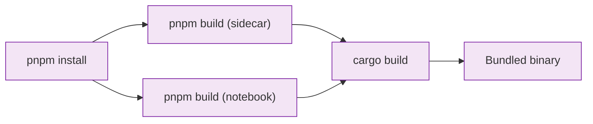

This guide covers building nteract Desktop from source for development and testing.

## Prerequisites

### Required Tools

| Tool | Version | Install |
|------|---------|---------||
| Node.js | 20+ | https://nodejs.org |
| pnpm | 10.12+ | `corepack enable` |
| Rust | 1.90.0 | https://rustup.rs |

<Note>
Rust version is managed by `rust-toolchain.toml`. You just need rustup installed.
</Note>

### Linux Only: Additional Dependencies

Install GTK/WebKit dev libraries:

```bash
sudo apt-get install -y libgtk-3-dev libwebkit2gtk-4.1-dev libxdo-dev
```

## Quick Start

<Steps>
  <Step title="Clone the repository">
    ```bash
    git clone https://github.com/nteract/desktop.git
    cd desktop
    ```
  </Step>
  
  <Step title="Install dependencies">
    ```bash
    pnpm install
    ```
  </Step>
  
  <Step title="Build">
    ```bash
    cargo xtask build
    ```
    
    This builds the frontend and Rust code in debug mode.
  </Step>
  
  <Step title="Run">
    ```bash
    cargo xtask run
    ```
    
    Or open a specific notebook:
    ```bash
    cargo xtask run path/to/notebook.ipynb
    ```
  </Step>
</Steps>

## Development Workflows

Choose the workflow that matches your development needs.

### Hot Reload (UI Development)

Best for iterating on React components. Changes hot-reload instantly.

```bash
cargo xtask dev
```

<Note>
Uses Vite dev server on port 5174. Frontend changes reload without restarting.
</Note>

### Standalone Vite + Attach (Multi-Window Testing)

When testing with multiple notebook windows, closing the first Tauri window normally kills the Vite server. Use this workflow to avoid that:

<CodeGroup>
```bash Terminal 1: Start Vite
cargo xtask vite
```

```bash Terminal 2+: Attach Tauri
cargo xtask dev --attach
```
</CodeGroup>

Now you can close and reopen Tauri windows without losing Vite. Useful for:
- Testing realtime collaboration
- Testing widgets across windows
- Avoiding confusion when one window close breaks others

### Debug Build (Rust Development)

Best for:
- Testing Rust changes
- Multiple worktrees (avoids port 5174 conflicts)
- Running the standalone binary

```bash
# Full build (frontend + Rust)
cargo xtask build

# Run the bundled binary
cargo xtask run

# Run with a specific notebook
cargo xtask run path/to/notebook.ipynb
```

### Rust-Only Rebuild (Fast Iteration)

When you're **only** changing Rust code (not the frontend), skip the frontend rebuild:

```bash
# First time: full build
cargo xtask build

# Subsequent rebuilds: Rust only (much faster)
cargo xtask build --rust-only
cargo xtask run
```

<Warning>
Requires an initial `cargo xtask build` first. The `--rust-only` flag reuses existing frontend assets.
</Warning>

Ideal for daemon development — build the frontend once, then iterate on Rust with fast rebuilds.

### Release Builds (Local Testing)

Mostly handled by CI for preview releases. Use locally only when testing:
- App bundle structure
- File associations
- Icons

<CodeGroup>
```bash Build .app/.AppImage/.exe
cargo xtask build-app
```

```bash Build DMG (macOS only)
cargo xtask build-dmg
```
</CodeGroup>

## Build Order and Dependencies

The UI must be built **before** Rust because:

- `crates/sidecar` embeds assets from `apps/sidecar/dist/` at compile time via [rust-embed](https://crates.io/crates/rust-embed)
- `crates/notebook` embeds assets from `apps/notebook/dist/` via Tauri

The `xtask` commands handle this automatically. If building manually:

```bash
pnpm build          # Build all UIs (sidecar, notebook)
cargo build         # Build Rust
```

### Build Dependency Graph



## Daemon Development

The notebook app connects to a background daemon (`runtimed`) that manages prewarmed environments and notebook document sync.

<Warning>
**Important:** The daemon is a separate process. When you change code in `crates/runtimed/`, the running daemon still uses the old binary until you reinstall it.
</Warning>

### Development Mode (Per-Worktree Isolation)

In production, the Tauri app auto-installs and manages the system daemon. In development, you control the daemon yourself.

**Benefits:**
- Isolated state per worktree (no conflicts when testing across branches)
- Your code changes take effect immediately on daemon restart
- No interference with the system daemon

**Two-terminal workflow:**

<CodeGroup>
```bash Terminal 1: Dev Daemon
cargo xtask dev-daemon
```

```bash Terminal 2: Notebook App
# Option 1: Hot reload
cargo xtask dev

# Option 2: Debug build
cargo xtask build
cargo xtask run

# Option 3: Fast Rust iteration
cargo xtask build --rust-only && cargo xtask run
```
</CodeGroup>

The app detects dev mode and connects to the per-worktree daemon instead of installing/starting the system daemon.

**Conductor users:** Dev mode is automatic when `CONDUCTOR_WORKSPACE_PATH` is set.

**Non-Conductor users:** Set `RUNTIMED_DEV=1`:

<CodeGroup>
```bash Terminal 1
RUNTIMED_DEV=1 cargo xtask dev-daemon
```

```bash Terminal 2
RUNTIMED_DEV=1 cargo xtask dev
```
</CodeGroup>

### Useful Daemon Commands

```bash
# Check daemon status
runt daemon status

# List all running dev daemons
runt daemon list-worktrees

# Tail daemon logs
runt daemon logs -f

# View recent logs
runt daemon logs -n 100

# Check running kernels
runt ps

# List open notebooks
runt notebooks
```

### Testing Against System Daemon (Production Mode)

When you need to test the full production flow (daemon auto-install, upgrades, etc.):

```bash
# Make sure dev mode is NOT set
unset RUNTIMED_DEV
unset CONDUCTOR_WORKSPACE_PATH

# Rebuild and reinstall system daemon
cargo xtask install-daemon

# Run the app (connects to system daemon)
cargo xtask dev
```

### Common Daemon Gotchas

If your daemon code changes aren't taking effect:

<Steps>
  <Step title="Check which mode you're in">
    ```bash
    runt daemon status
    ```
    
    Look for "Dev mode" or "Worktree path" in the output.
  </Step>
  
  <Step title="In dev mode: Restart dev daemon">
    ```bash
    # Terminal 1
    # Ctrl+C to stop
    cargo xtask dev-daemon
    ```
  </Step>
  
  <Step title="In production mode: Reinstall">
    ```bash
    cargo xtask install-daemon
    ```
  </Step>
</Steps>

If the app says "Dev daemon not running":
- You're in dev mode but haven't started the dev daemon
- Run `cargo xtask dev-daemon` in another terminal first

### Daemon Logs Location

**Production:**
```
~/Library/Caches/runt/runtimed.log  (macOS)
~/.cache/runt/runtimed.log          (Linux)
```

**Dev mode:**
```
~/.cache/runt/worktrees/{hash}/runtimed.log
```

## Command Reference

### xtask Commands

| Command | Description | Use When |
|---------|-------------|----------|
| `cargo xtask dev` | Hot reload mode | Iterating on React UI |
| `cargo xtask vite` | Standalone Vite server | Multi-window testing |
| `cargo xtask dev --attach` | Attach to existing Vite | Connect Tauri to running Vite |
| `cargo xtask build` | Full debug build | Testing Rust changes |
| `cargo xtask build --rust-only` | Rust-only rebuild | Fast Rust iteration |
| `cargo xtask run` | Run bundled binary | Test standalone app |
| `cargo xtask build-app` | Build release .app | Testing app bundle |
| `cargo xtask build-dmg` | Build release DMG | Distribution (usually CI) |
| `cargo xtask dev-daemon` | Start dev daemon | Development mode |
| `cargo xtask install-daemon` | Install system daemon | Production mode |

### pnpm Commands

| Command | Description |
|---------|-------------|
| `pnpm install` | Install all dependencies |
| `pnpm build` | Build all UIs |
| `pnpm test:run` | Run JS tests |
| `pnpm --dir apps/notebook dev` | Start notebook dev server |
| `pnpm --dir apps/sidecar build` | Build sidecar UI |

### Cargo Commands

| Command | Description |
|---------|-------------|
| `cargo test` | Run Rust tests |
| `cargo fmt` | Format Rust code |
| `cargo clippy --all-targets -- -D warnings` | Lint Rust code |
| `cargo build` | Build Rust (debug) |
| `cargo build --release` | Build Rust (release) |

## Test Notebooks

The `notebooks/` directory has test files:

```bash
cargo xtask build
./target/debug/notebook notebooks/test-isolation.ipynb
```

## Troubleshooting

### Build Fails: "apps/sidecar/dist/ not found"

The sidecar UI needs to be built first:

```bash
pnpm --dir apps/sidecar build
cargo build
```

Or use `cargo xtask build` which handles this automatically.

### Build Fails: Rust Toolchain Version

Ensure you have rustup installed. The project's `rust-toolchain.toml` will automatically install the correct version:

```bash
# Install rustup if not present
curl --proto '=https' --tlsv1.2 -sSf https://sh.rustup.rs | sh

# Then build
cargo xtask build
```

### Port 5174 Already in Use

Another `cargo xtask dev` or `cargo xtask vite` is running.

Either:
- Stop the other instance
- Use `cargo xtask build` instead (no port needed)
- Use worktrees with isolated ports (Conductor sets `CONDUCTOR_PORT` automatically)

### "Command not found: pnpm"

Enable corepack (ships with Node.js 16+):

```bash
corepack enable
```

### Changes Not Appearing

**Frontend changes:** Make sure you're running `cargo xtask dev` (hot reload) or rebuild with `cargo xtask build`.

**Rust changes:** Rebuild with `cargo xtask build` or `cargo xtask build --rust-only`.

**Daemon changes:** Restart the dev daemon (`cargo xtask dev-daemon`) or reinstall the system daemon (`cargo xtask install-daemon`).

## Next Steps

- [Testing Guide](/development/testing) - Run tests and write new ones
- [Architecture Deep Dive](/development/architecture-deep-dive) - Understand the system design
- [Contributing Guidelines](/development/contributing) - Contribution workflow